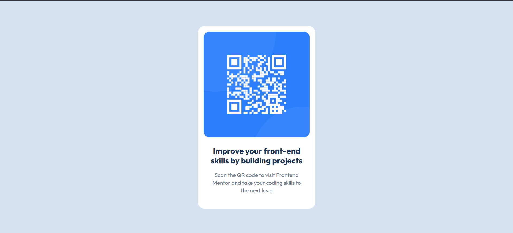

# Frontend Mentor - Solución al componente de código QR

Esta es una solución al [desafío del componente de código QR en Frontend Mentor](https://www.frontendmentor.io/challenges/qr-code-component-iux_sIO_H). Los desafíos de Frontend Mentor te ayudan a mejorar tus habilidades de programación construyendo proyectos realistas.

## Tabla de contenidos

- [Resumen](#resumen)
  - [Captura de pantalla](#captura-de-pantalla)
  - [Enlaces](#enlaces)
- [Mi proceso](#mi-proceso)
  - [Construido con](#construido-con)
  - [Lo que aprendí](#lo-que-aprendí)
  - [Desarrollo continuo](#desarrollo-continuo)
  - [Recursos útiles](#recursos-útiles)
- [Autor](#autor)
- [Agradecimientos](#agradecimientos)

## Resumen

### Captura de pantalla




### Enlaces

- URL de la solución: [Agrega la URL de tu solución aquí](https://your-solution-url.com)
- URL del sitio en vivo: [Agrega la URL del sitio en vivo aquí](https://your-live-site-url.com)

## Mi proceso

### Construido con

- HTML5 semántico
- Propiedades personalizadas de CSS
- Flexbox
- CSS Grid

### Lo que aprendí

Utiliza esta sección para recapitular algunos de tus principales aprendizajes mientras trabajabas en este proyecto. Escribirlos y proporcionar ejemplos de código de las áreas que quieras destacar es una excelente manera de reforzar tu propio conocimiento.

Para ver cómo puedes agregar fragmentos de código, mira abajo:

```html
<h1>Un código HTML del que estoy orgulloso</h1>
```
```css
.proud-of-this-css {
  color: papayawhip;
}
```
```js
const proudOfThisFunc = () => {
  console.log('🎉')
}
```

Si quieres más ayuda con la escritura de markdown, te recomendamos revisar [The Markdown Guide](https://www.markdownguide.org/) para aprender más.

### Desarrollo continuo

Utiliza esta sección para describir áreas en las que quieras seguir enfocándote en futuros proyectos. Pueden ser conceptos con los que aún no te sientas completamente cómodo o técnicas que encontraste útiles y quieras perfeccionar.

### Recursos útiles

- [Recurso de ejemplo 1](https://www.example.com) - Esto me ayudó por XYZ razón. Me gustó mucho este patrón y lo usaré en el futuro.
- [Recurso de ejemplo 2](https://www.example.com) - Este es un artículo increíble que finalmente me ayudó a entender XYZ. Lo recomendaría a cualquiera que aún esté aprendiendo este concepto.

## Autor

- Sitio web - [Agrega tu nombre aquí](https://www.your-site.com)
- Frontend Mentor - [@tuusuario](https://www.frontendmentor.io/profile/yourusername)
- Twitter - [@tuusuario](https://www.twitter.com/yourusername)

## Agradecimientos

Aquí puedes dar crédito a cualquier persona que te haya ayudado en este proyecto. Tal vez trabajaste en equipo o te inspiraste en la solución de alguien más. Este es el lugar perfecto para darles reconocimiento.

